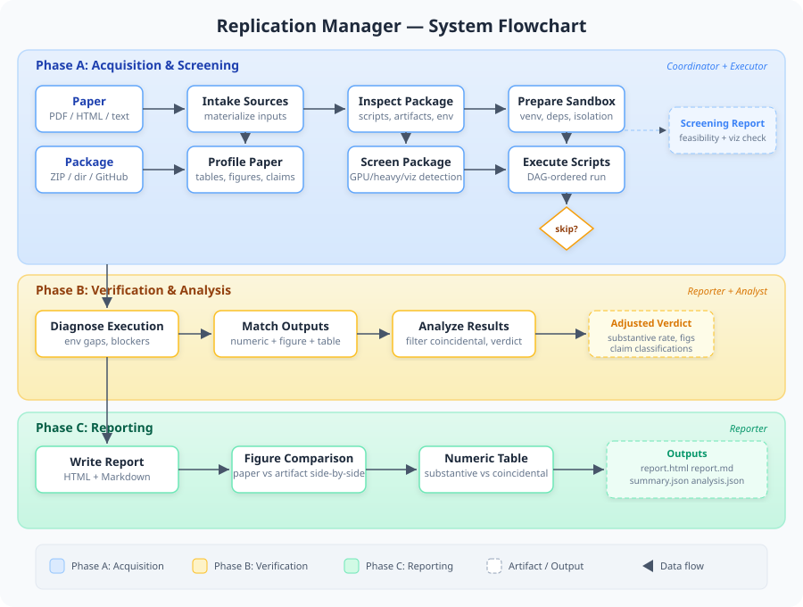

# Architecture

## Three-Phase Workflow

The system runs a deterministic, skill-based pipeline in three phases. Each phase is owned by one or more internal agents that execute specific skills in sequence.



### Phase A: Acquisition & Screening

| Agent | Skill | Purpose |
|-------|-------|---------|
| Coordinator | `intake_sources` | Materialize paper (PDF/HTML/text) and package (ZIP/dir/GitHub) |
| Coordinator | `profile_paper` | Extract tables, figures, and numeric claims from the paper |
| Coordinator | `inspect_package` | Discover scripts, artifacts, and environment files |
| Coordinator | `screen_package` | Classify scripts (lightweight/GPU/heavy), detect visualization code, check data availability |
| Executor | `prepare_workspace` | Create sandbox with isolated venv, R libs, and dependency bootstrap |
| Executor | `execute_package` | Run scripts in DAG-ordered sequence |

### Phase B: Verification & Analysis

| Agent | Skill | Purpose |
|-------|-------|---------|
| Executor | `diagnose_execution` | Identify environment gaps, blocked stages, and missing dependencies |
| Reporter | `match_outputs` | Precision-aware numeric matching, table comparison, image hashing for figures |
| Analyst | `analyze_results` | Filter coincidental matches (citations, versions), compute adjusted verdict |

### Phase C: Reporting

| Agent | Skill | Purpose |
|-------|-------|---------|
| Reporter | `write_report` | Generate HTML and Markdown reports with side-by-side figure comparison |

## Module Map

| Module | Purpose |
|--------|---------|
| `workflow.py` | Skill-based state machine orchestrating the three-phase pipeline |
| `pipeline.py` | Public API entry point (thin wrapper around `workflow.py`) |
| `screening.py` | Pre-execution feasibility analysis and script classification |
| `analysis.py` | Post-comparison heuristic filtering and adjusted verdict computation |
| `paper.py` | PDF/HTML/text parsing with pdfplumber structured table extraction |
| `compare.py` | Precision-aware numeric matching and optional image hashing |
| `sandbox.py` | Isolated execution with Python venv, R libs, conda support |
| `dag.py` | Script dependency graph for topological execution ordering |
| `reporting.py` | HTML/Markdown report generation with side-by-side figure comparison |
| `runner.py` | Script execution with timeout, logging, and output capture |
| `package.py` | Package download, unzip, inspection, and artifact collection |
| `agents.py` | Agent role definitions and trace building |
| `models.py` | Shared dataclasses for manifests, matches, and results |
| `cli.py` | Command-line interface |

## Project Layout

```
replication-manager/
  src/replication_manager/     # Python package (src layout for clean imports)
  tests/                       # Test suite and fixtures
  docs/                        # Flowchart, architecture docs, conversation log
  examples/                    # Example replication packages
    nature-ai-impacts/         # Hao et al. 2026, Nature 649
  runs/                        # Replication run outputs (only nature-final committed)
    nature-final/              # Final Nature paper run with reports and artifacts
  .claude/skills/              # Claude Code skills for interactive use
  pyproject.toml               # Package metadata and dependencies
```

The `src/` layout is [standard Python packaging practice](https://packaging.python.org/en/latest/discussions/src-layout-vs-flat-layout/) — it prevents accidental imports from the source tree during development and ensures tests run against the installed package.

## Screening Intelligence

The screening phase classifies every script before execution:

- **GPU scripts**: torch, tensorflow, cuda imports
- **Heavy-compute scripts**: chunked reads, distributed processing, large-data indicators
- **Visualization scripts**: matplotlib, seaborn, ggplot, savefig, plotly usage
- **Data processing**: scripts with missing input files

It also detects:
- **Source data files**: SourceData files matching figure numbers
- **Visualization gaps**: packages with source data but no plotting code

## Coincidental Match Filtering

After numeric comparison, the analysis module classifies each match as substantive or coincidental using context-based heuristics:

**Filtered as coincidental:**
- Citation/reference numbers (e.g., "refs. 37,38" matching 37.0)
- Software version numbers (e.g., "Python 3.11")
- Equation/figure/table numbers
- Page references
- Numbers from bibliography sections

**Kept as substantive:**
- Percentages, rates, coefficients
- Sample sizes, counts
- Statistical values (p-values, CIs, effect sizes)
- Measurements from Results/Discussion sections

The adjusted verdict is computed from substantive claims only, avoiding inflated match rates.

## Supported Environments

| Type | Detected From |
|------|---------------|
| Python deps | `requirements.txt`, `pyproject.toml`, `setup.py`, `setup.cfg` |
| R deps | `renv.lock`, `install.R`, `packages.R`, `setup.R` |
| Conda | `environment.yml` |
| Code Ocean | `.codeocean/` directory with mount path shimming |
| Stata | `.do` files via `REPLICATION_MANAGER_STATA_BIN` |
